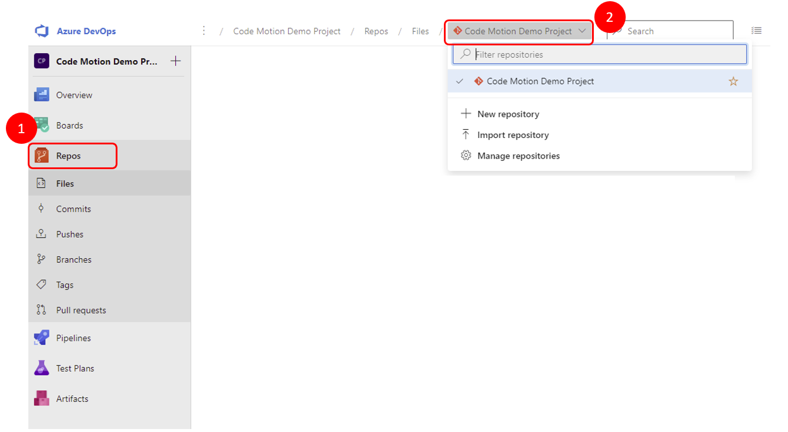

# azuredevpos-intro-workshop

## Preparando lo necesario
Algunos flujos que se van a definir pierden un poco el sentido si todos los pasos los ejecuta el mismo usuario. Aunque se puede hacer y no hay problema, resulta más ilustrativo si se hace con más de un usuario. Si tienes más de una cuenta de correo, puedes usarlas para simular con ellas diferentes usuarios. Otra opción es hacer esto en pareja con alguien y ser cada uno contribuidor del otro.
### Cuenta de Azure DevOps donde vamos a trabajar
+ Tener una cuenta de outlook (de las normales, valen las gratuitas) [Puedes crear una aquí](https://outlook.live.com/owa/) o una cuenta de Github
+ [Crear una organización en Azure DevOps con la cuenta de outlook](https://azure.microsoft.com/en-us/services/devops/)
    + Selecciona Start free si tienes cuenta de Outlook
    + Selecciona Start fee with GitHub si tienes cuenta de GitHub: deberás autorizar a que Microsoft tenga acceso a tu cuenta y completar el proceso de verificación de que efectivamente eres tú

Una vez completado el proceso de crear la organización en Azure DevOps, os remitirá a una url del tipo https://dev.azure.com/nombreOrganizacion . Si olvidáis el nombre de la organización, siempre podéis volver a la url donde creasteis la organización (https://azure.microsoft.com/en-us/services/devops/) y desde ahí seleccionar "Sign in to Azure DevOps" para que os lleve a vuestra organización
#### Instalación de la Azure Cli

+ [Instala la Azure Cli](https://docs.microsoft.com/en-us/cli/azure/install-azure-cli?view=azure-cli-latest)
+ Añade la extensión de Azure DevOps:

       az extension add --name azure-devops
    
    + Si al ejecutar el comando en Windows no reconoce 'az' como una expresión válida, es que falta añadir al path C:\Program Files\Microsoft SDKs\Azure\.NET SDK\v2.9
+ [Crea un Token de Acceso personal (PAT)](https://docs.microsoft.com/en-us/azure/devops/organizations/accounts/use-personal-access-tokens-to-authenticate?view=azure-devops&tabs=preview-page#create-a-pat): el scope a elegir será de "Full access". Copia y guarda el token cuando se muestre ya que será el que usemos para hacer el login desde la Azure Cli
+ Configura como default la organización creada anteriormente para no tener que escribirla cada vez que ejecutemos un comando:

       az devops configure --defaults organization=https://dev.azure.com/tu-organizacion
### Código y Framework
En la práctica vamos a trabajar con un proyecto desarrollado en [.NET 5](https://dotnet.microsoft.com/download) y los pantallazos que me veréis del IDE serán de [Visual Studio Code](https://code.visualstudio.com/)

Evidentemente, no es obligatorio ni usar mi proyecto de ejemplo, ni trabajar con ese lenguaje, ni con ese IDE. Mi elección se basa tanto en que a mí me resultan familiares y cómodos como en que son multiplataforma.

#### Instalación de .Net Core
+ Windows: Se descarga el instalable de [.NET 5](https://dotnet.microsoft.com/download)
+ Linux: En la mayoría de las distribuciones se puede [instalar a través del package manager](https://docs.microsoft.com/en-us/dotnet/core/install/linux). Otra opción es descargarse los binarios de [aquí](https://dotnet.microsoft.com/download/dotnet/5.0) y realizar la instalación manualmente

#### Instalación de Visual Studio Code
Desde su [página](https://code.visualstudio.com/download) se puede descargar el instalador para Windows y los paquetes para Linux

## Creando nuestro primer proyecto y añadiendo a colaboradores
### Desde la interfaz
#### Crear un nuevo proyecto
Desde la página de nuestra nueva organización de Azure DevOps nos saldrá por defecto una página para crear un nuevo proyecto:
. Lo nombramos como "Code Motion Demo Project", seleccionamos como visibilidad Private y damos al botón de crear un nuevo proyecto.

Una vez creado, si volvemos a la página principal de la organización podemos ver listado nuestro nuevo proyecto creado y nos aparece el botón de crear un nuevo proyecto desde la interfaz de igual manera que el que acabamos de crear.
#### Añadir un colaborador
Hay dos maneras de hacerlo:
+ Desde el proyecto, se añade un colaborador (con el correo electrónico) a uno de los grupos creados
    + Desde Project settings > Permissions > Se selecciona un grupo
    
    + En el apartado de Members del grupo, se selecciona Add > Se escribe el email y se guarda
    + Por defecto se creará con un nivel de acceso de Stakeholder, por lo que no podrá ver los repositorios. El nivel de acceso se cambia desde los settings de la organización
+ Desde la organización: en la esquina inferior derecha aparece el enlace a Organization settings
    + En el menú de Organization Settings, se selecciona Users
    + Pasamos el ratón sobre el colaborador añadido previamente. Nos aparecerán tres puntitos a la derecha del registro. Si hacemos click, sobre el menú que aparece, seleccionamos la opción de Change access level y cambiamos de Stakeholder a Basic y guardamos
    + En el menú de Users, seleccionamos Add users. Añadimos el email de otro colaborador, seleccionamos el Access level como Basic, los proyectos a los que queremos añadirles y en qué grupo lo vamos a incluir (seleccionamos Project Contributors) y guardamos.
    + Si accediésemos al grupo de Contributors del proyecto ahora veríamos al usuario que acabamos de añadir

### Por línea de comando

Lo primero es logarse:

       az devops login

El token que solicita es el Token de acceso personal que obtuvimos antes.
En caso de que tuviésemos una subscripción a Azure, también sería válido el login con 

       az login

En todos los comandos a continuación no vamos a especificar la organización porque ya configuramos cuál era la que se cogía por defecto. Si no lo hubiésemos hecho, tendríamos que indicarla con el parámetro --org a cada uno de los comandos

#### Crear un nuevo proyecto
Creamos un proyecto con visibilidad privada y nombre "CodeMotion WokShop Project Command Line"

       az devops project create --name "CodeMotion WokShop Project Command Line"

Por defecto nos lo crea con visibilidad privada.
Como vamos a estar usando este proyecto para todos los comandos por consola, vamos a definirlo como el proyecto por defecto para no tener que definir el parámetro de proyecto en todos los comandos

       az devops configure --defaults project="CodeMotion WokShop Project Command Line"

#### Añadir un colaborador
Añadimos a un usuario a la organización con una licencia de tipo Basic (y no le enviamos un email al hacerlo)

       az devops user add --email-id email --license-type express --send-email-invite false

Una vez añadido el usuario a la organización, lo añadimos al grupo de Contributors del proyecto. Para añadir al usuario al proyecto necesitamos saber el "descriptor" del grupo. Para obtenerlo, listamos los grupos del proyecto y del output obenido recogemos el descriptor del grupo de Contributors

       az devops security group list

Buscamos el grupo con el displayName de Contributors:

           {
      "description": "Members of this group can add, modify, and delete items within the team project.",
      "descriptor": "vssgp.Uy0xLTktQRU1SWM3NDI0NS0xODAyMTAwNzY2LTI1MzU3MjIwNTItMjMyNjkzMzU3OS0zMjY3NDI5NDYzLTEtNzYxNDIxODkyLTI3NDg1NDQ4NDUtMjk3NzI0MjIzOS0zMTUwMzI1NTI0",
      "displayName": "Contributors",
      "domain": "vstfs:///Classification/TeamProject/ebdf696b-2497-440c-8ab2-304bc2c10457",
      "isCrossProject": null,
      "isDeleted": null,
      "isGlobalScope": null,
      "isRestrictedVisible": null,
      "legacyDescriptor": null,
      "localScopeId": null,
      "mailAddress": null,
      "origin": "vsts",
      "originId": "751219bc-8b64-4e85-b249-7967470a0c49",
      "principalName": "[test from console]\\Contributors",
      "scopeId": null,
      "scopeName": null,
      "scopeType": null,
      "securingHostId": null,
      "specialType": null,
      "subjectKind": "group",
      "url": "https://vssps.dev.azure.com/testtest/_apis/Graph/Groups/vssgp.Uy0xLTktMTU1MTM3NDI0NS0xODAyMTAwNzE1LTI1MzU3MjIwNTItMjMyNjkzMzU3OS0zMjY3NDI5NDYzLTEtNzYxNDIxODkyLTI3NDg1NDQ4NDUtMjk3NzI0MjIzOS0zMTUwMzI1NTI0"
    }

Con el descriptor copiado, ejecutamos el comando:

        az devops security group membership add --group-id descriptor --member-id email_colaborador

## Creamos un repositorio en el proyecto
Por defecto, al crear un proyecto se crea un repositorio con el mismo nombre. Como lo normal en un proyecto es tener más de una única aplicación se tendrá la necesidad de ir creando más repositorios para alojar a cada una de las aplicaciones aunque las mantengamos englobadas bajo el mismo proyecto porque la gestión de los permisos de sus componentes es común.
Vamos a ver cómo crear un nuevo repositorio y borrar uno ya existente. Para realizar estas acciones, se deben hacer con un usuario que tenga los permisos de:
+ Create repository
+ Delete repository

De los grupos de seguridad que se crean al crear el proyecto, este permiso lo tienen:
+ Project Collection Administrators
+ Project Administrators

Estas acciones, por lo tanto, vamos a ejecutarlas con el usuario que creó el proyecto y no con el colaborador que añadimos previamente, ya que al estar en el grupo de Contributors no tendrá permisos.

### Desde la interfaz gráfica
Accedemos a nuestro proyecto de "Code Motion Demo Project" y en el menú lateral izquierdo hacemos click sobre Repos. Al hacerlo, en la parte de arriba, veremos que nos está marcando la ruta donde nos encontramos como:
organizacion / Code Motion Demo Project / Repos / Files / (icono de git) Code Motion Demo Project

Justo a la derecha del nombre del repositorio hay una flecha, que al hacer click sale un desplegable donde se puede ver el listado de repositorios del proyecto y además nos da las opciones de:
+ Crear un repositorio
+ Importar un repositorio
+ Gestionar los repositorios

Tanto desde aquí como desde Gestinar los repositorios podremos crear un nuevo repositorio.
Sólo desde aquí tenemos la opción de clonar un repositorio ya existente.
Sólo desde Gestionar los repositorios podremos renombrar y borrar los repositorios ya existentes.

Seleccionamos entonces Importar repositorio:
+ Tipo de repositorio: Git
+ Url a clonar: la de este mismo repo: https://github.com/TheLadyB/azuredevpos-intro-workshop
+ Nombre: azuredevpos-intro-workshop

Una vez clonado, desde Manage Repositories eliminamos el repositorio que se creó por defecto al crear el proyecto.

### Por línea de comando
Se tiene que hacer en dos pasos: primero se crea el repositorio y posteriormente se importa el contenido en el mismo
       
       az repos --create --name azuredevpos-intro-workshop
       az repos import create --git-source-url https://github.com/TheLadyB/azuredevpos-intro-workshop -r azuredevpos-intro-workshop
        
En caso que estuviésemos clonando un repositorio privado, en la instrucción de importación habría que indicar que requiere autorización. Al hacerlo, nos pedirá el PAT del usuario que tiene permisos para acceder al repo privado. Por ejemplo, en caso de que este repositorio fuese privado, el comando sería el seguiente:

       az repos import create --git-source-url https://github.com/TheLadyB/azuredevpos-intro-workshop -r azuredevpos-intro-workshop --requires-authorization 

Una vez clonado el repo, eliminamos el que se creó por defecto al crear el proyecto:

       az repos list

Obtenemos el id del repositorio por defecto (tiene el mismo nombre que el proyecto)

       az repos delete --id id-repositorio-defecto

###Inclusión del appsettings.json
Para que el código funcione, es necesario incluir un archivo de appsettings.json al mismo nivel que Program.cs y otro al mismo nivel que DevOpsConnectorTest.cs con la siguiente información:
       
       {
              "Pat": "pat",
              "Organization": "nombre_organizacion",
              "Project": "nombre_proyecto",
              "Usuario": "email usuario dado de alta"
       }

### Creación de una pipeline que compile el código y ejecute las pruebas
Accedemos al proyecto donde tenemos nuestro código y en el menú lateral izquierdo accedemos a la sección de Pipelines y pulsamos el botón de Create Pipeline:

* Elegimos Azure Repo Git como origen de nuestro código
* Elegimos crear una pipeline con estructura básica
* En el archivo yaml que nos aparece para editar lo dejamos de la siguiente manera:

       # Starter pipeline
       # Start with a minimal pipeline that you can customize to build and deploy your code.
       # Add steps that build, run tests, deploy, and more:
       # https://aka.ms/yaml

       pool:
       vmImage: ubuntu-latest

       steps:
       - task: UseDotNet@2
       displayName: 'Install .NET 5.0.x SDK'
       inputs:
       version: '5.0.x'
       performMultiLevelLookup: true
       includePreviewVersions: true # Required for preview versions

       - task: DotNetCoreCLI@2
       displayName: "Compilación del proyecto"
       inputs:
       command: 'build'
       projects: '**/*.csproj'

       - task: DotNetCoreCLI@2
       displayName: "Ejecución de las pruebas"
       inputs:
       command: 'test'
       projects: '**/test.csproj'

* Modificamos el nombre de la pipeline por "Pipeline-compilacion" en lugar del nombre por defecto que nos aparece. 

* Seleccionamos Save and Run para guardar y forzar una ejecución de la pipeline que acabamos de crear

### Creación de una pipeline que genere el artefacto

Repetimos el proceso anterior de compilación de la pipeline con las siguientes diferencias:
* Nombramos a la pipeline como "Pipeline-generadora-artefacto"
* La pipeline es igual a la anterior, pero añadiendo estos steps

       - task: DotNetCoreCLI@2
         displayName: "Compilación del proyecto"
         inputs:
          command: 'build'
          projects: '**/*.csproj'

       - task: DotNetCoreCLI@2
         displayName: "Ejecución de las pruebas"
         inputs:
          command: 'test'
          projects: '**/test.csproj'

* Previo a la variable del pool incluimos el trigger (queremos ejecutarlo cuando se suba el código a la rama main)

       trigger:
       - main

###Creamos las ramas
Se pueden crear desde la propia interfaz o mediante línea de comando de git como con cualquier otro repositorio de git. En este caso, vamos a clonar el repositorio y crear las ramas desde la línea de comandos.

* Clonamos el repositorio (incluimos el que hemos creado mediante la interfaz y sobre el que hemos estado trabajando todo el ramo mediante la línea de comandos)

       git clone https://organizacion@dev.azure.com/organizacion/CodeMotion%20WokShop%20roject%20Command%20Line/_git/azuredevpos-intro-workshop && \
       git clone https://organizacion@dev.azure.com/organizacion/Code%20Motion%20Demo%20Project/_git/azuredevpos-intro-workshop

Y desde la ubicación de cada uno de nuestros repositorios, creamos las ramas y las mandamos a origen

       git checkout -b qa
       git push origin master

       git checkout -b develop
       git push origin develop

####Asignamos develop como la default branch
Desde el apartado de branches, posicionamos el ratón sobre la rama de develop y en el menú de tres puntitos que aparece a la derecha seleccionamos "Set as default branch"

###TODO:

+   Crear pipeline que compile el código y ejecute las pruebas
+   Añadir control de flujo de ramas a la pipeline
+   Crear ramas
+   Poner como default la de develop
+   Crear algún grupo más a usar en la gestión de política de ramas y añadirle a los usuarios
+   Añadir políticas a las ramas: que la pipeline se ejecute OK y que los aprobadores den su ok
+   Restringir los nombres con los que se pueden crear ramas
+   Configurar nuestro local para que pueda comunicarse con el repo
+   Crear pipeline que genera el artefacto
+   Crear pipeline de despliegue
+   Flujo desde la creación de una incidencia, su resolución y cómo va subiendo por el flujo
    + Listar pullrequests pendientes de mi aprobación y cómo aprobarlas y completarlas
    + Ver ejecuciones de pipelines